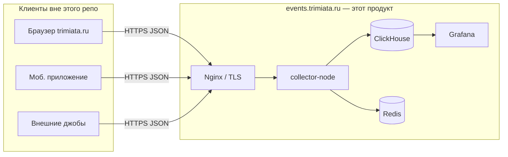

## Архитектура и потоки — **events.trimiata.ru**

### Scope репозитория
- **Продукт этого проекта** — площадка сбора и обработки событий для домена **events.trimiata.ru** (отдельно от публичного сайта **trimiata.ru**). Цель — **аналитика на основе событий и система рекомендаций**: накопление в **ClickHouse**, агрегации и джобы (**Python**), выдача и кэш (**Redis**), наблюдаемость (**Grafana**); ядро **Bitrix** сюда не входит.
- **Нет Bitrix и нет каталога `app/`** как части поставки: коллектор, хранилище и дашборды живут в **`system/events-service/`**.
- **Основной сайт (PHP/Bitrix)** при необходимости описан справочно: [reference-architecture-main-site-bitrix.md](./reference-architecture-main-site-bitrix.md) — для согласования HTTP-контракта событий и понимания, откуда приходят клиенты (браузер, приложение, бэкенд).

### Компоненты контура events.trimiata.ru

| Компонент | Роль | Код / конфиг |
|-----------|------|----------------|
| **Collector (Node)** | Ingestion `POST /v1/events`, batch, валидация по контракту | `system/events-service/apps/collector-node/` |
| **Контракт событий** | JSON Schema, общие типы | `system/events-service/packages/contract/` |
| **ClickHouse** | Сырые и проектные таблицы (`events_raw`, джобы, пары) | `system/events-service/infra/clickhouse/sql/` |
| **Redis** | Очереди / serving (по мере внедрения) | compose в `infra/compose/` |
| **Grafana** | Дашборды | `system/events-service/infra/grafana/` |
| **Jobs (Python)** | Агрегации, импорты (каркас) | `system/events-service/apps/jobs-python/` |
| **Nginx (пример)** | Терминация TLS, прокси на collector | `system/events-service/infra/nginx/` |

Операции: `system/events-service/Makefile`, `system/events-service/scripts/*.sh`, см. [system/events-service/README.md](../system/events-service/README.md).

### Поток данных (Mermaid)

### Аналогия структуры с Bitrix (только для ориентира)

Так же, как на основном сайте разделены **публичный слой** (`app/`), **локальная логика** (`local/`) и **интеграции** (`app/api/`), здесь разделены:
- **runtime приложения** → `apps/*`
- **общие правила данных** → `packages/contract`
- **инфраструктура и DDL** → `infra/*`

PHP и `local/php_interface` в **этом** репозитории не используются.

### Интеграция с trimiata.ru
- Связь **только по сети**: HTTPS на хост **events.trimiata.ru**, тело запросов соответствует [event-contract.md](../system/events-service/docs/event-contract.md) и схеме `packages/contract/schema/event.jsonschema.json`.
- Не добавлять зависимость от Bitrix ORM, `init.php` или файлов `app/` в код collector/jobs.

### Типичные ошибки (этот репозиторий)
- Класть DDL ClickHouse или дубли compose в «архивные» папки вне `system/events-service/infra/`.
- Валидировать события «на глаз» в collector вместо общего пакета `packages/contract`.
- Путать домен **events.trimiata.ru** с админкой/сайтом Bitrix — разные процессы, разные деплои.

### Документация рядом с кодом
- **Дерево каталогов и правила:** [system/events-service/docs/STRUCTURE.md](../system/events-service/docs/STRUCTURE.md)
- Детальная архитектура стека: [system/events-service/docs/architecture.md](../system/events-service/docs/architecture.md)
- Деплой и отладка: `system/events-service/docs/deployment.md`, `debugging.md`
