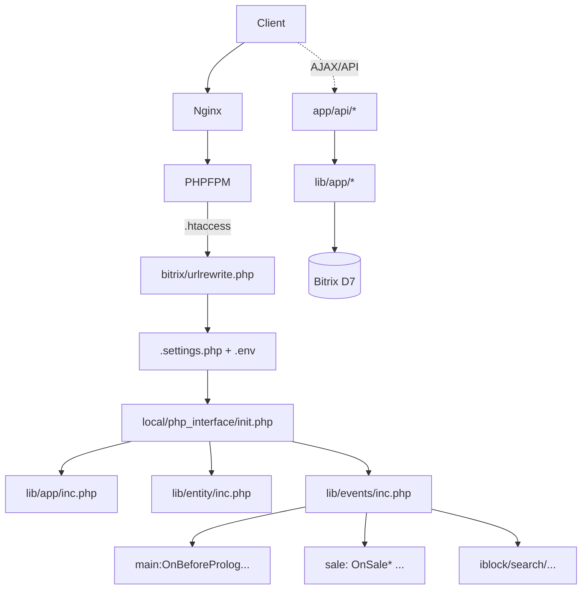

# Справка: архитектура основного сайта trimiata.ru (Bitrix)

> **Не входит в продукт events.trimiata.ru.** Этот файл сохранён для согласования контрактов и понимания смежной системы: где на основном сайте живут каталог, API и интеграции. Код находится в **отдельном репозитории/клоне** с DocumentRoot `app/` и ядром Bitrix.

---

## Архитектура и потоки

### Компоненты системы
- Веб-приложение Bitrix (DocumentRoot `app/`):
  - Точки входа: `index.php`, `urlrewrite.php`, `app/.htaccess` → `/bitrix/urlrewrite.php`.
  - Шаблон: `local/templates/trimiata` (инициализация ассетов, JS-модули, UI).
  - Доменные слои: `local/php_interface/lib/app/*` (Ctx/Config/Seo/Catalog/Order/...)
  - События (D7): `local/php_interface/lib/events/*`.
  - Компоненты: `local/components/{app,opensource,trimiata,koptelnya}/*`.
- Интеграции и API: `app/api/*` (webhook для ImShop, 1C и т.д.).
- Инфраструктура основного сайта: docker compose (`system/server/compose.yaml`, при наличии в клоне), Dockerfile’ы в `system/lib/*` (если подключены в вашем репозитории).

### Монорепозиторий (полный клон): что не смешивать
- **`app/`** — один процесс: PHP-FPM + Bitrix, публичные маршруты и `app/api/*`.
- **`system/events-service/`** — отдельный контур: ingestion событий (Node), ClickHouse, Redis, Grafana. Связь с сайтом — по HTTP/контракту (`packages/contract`), не через `local/php_interface`. Документация: `system/events-service/README.md`.
- **`system/.dev/`** — вспомогательные скрипты разработки.
- **`app/local/changes/`** — зона «изменений» (шаблонные исходники, миграции задач); **`app/local/templates/trimiata/`** — то, что отдаётся веб-серверу после сборки и синхронизации.

### Типичные ошибки (архитектура, основной сайт)
- Дублировать бизнес-логику в `app/api/*` и в компонентах без общего слоя — приводит к расхождению контрактов с ImShop/моб. приложением.
- Хардкодить SEO/префиксы фильтра вместо `Seo::getPropsRegulars()` и `Catalog\Helper::checkUriOrder*()` — ломает канонические URL.
- Писать DDL/операции ClickHouse для events-контура в `app/local/changes/db/*` — канон DDL и compose только в `system/events-service/infra/`.

### Жизненный цикл запроса
1) Nginx → PHP-FPM → `.htaccess` → `/bitrix/urlrewrite.php`.
2) Bitrix грузит `bitrix/.settings.php` (монтируется из `system/server/data/bitrix/.settings.php` при типовом Docker), читает `app/.env`.
3) `local/php_interface/init.php` подключает autoload, `lib/app/inc.php`, `lib/entity/inc.php`, `lib/events/inc.php`.
4) События D7: `main:OnBeforeProlog`, `sale:*`, `iblock/...`.

### Потоки данных (Mermaid)

### Аналогия путей для поставщиков событий

| Зона основного сайта (Bitrix) | Что отправляет на events.trimiata.ru |
|------------------------------|--------------------------------------|
| Браузер / `AppAnalytics.js` | HTTP `POST /v1/events` (или batch) по контракту `packages/contract` |
| `app/api/*` | Не обязательно; приоритет — отложенная очередь с клиента/воркера |

Далее — детали каталога, смарт-фильтра, Quick Buy и стиля PHP **только для репозитория с `app/`**.

### Внешние интеграции (Service-паттерн)
- Каждая интеграция реализуется в двух слоях:
  - Service: HTTP (curl, заголовки, базовые хосты), единый `__call($method, $args)`.
  - Фасад/исполняемый класс: доменные методы, подготовка пейлоадов и маршрутизация в Service.
- Примеры:
  - Telegram: `App\Telegram\Service` + `App\Telegram\Bot`.
  - Notion: `App\Notion\Service` + `App\Notion\Notion`.
- Вебхуки под API используют `app/api/core.php` (`ApiResult`) для JSON/статусов.
- Данные интеграций в `upload/<service>/...` (раздельные каталоги).

### ЧПУ каталога и SEO-нормализация
- ЧПУ-шаблоны (в `app/local/components/app/catalog.full/class.php::getUrlTemplates()`):
  - `/catalog/{category}/`, `/catalog/{category}/{subcategory}/`, `/catalog/{category}/{subcategory}/{model}/`.
- Нормализация URL и 301-редиректы до роутинга:
  - `events/main/BeforeProlog::init()`: lowercase, двойные слэши, слэш в конце, пагинация `/page-N/` вместо `?PAGEN_1=N`.
  - `events/main/BeforeProlog::checkForceRedirects()` — выправление известных некорректных путей.
- Смарт‑фильтр и порядок параметров:
  - `Catalog\Helper::checkUriOrderAndRedirect()` поддерживает канонический порядок параметров фильтра.
  - Для подвидов (SUBCATEGORY) используется чистый сегмент `/{subcategory}/` — фильтр не добавляет префиксы в путь.
  - Заголовки подвидов используют конфиг `catalog.categories.genitiveByName` через `Ctx::config()` для корректного родительного падежа (напр., «подвид часов», «подвид серег»).
- Каноникал и OG:
  - `Template\Helper::setMeta()` формирует `<link rel="canonical">`, OG‑мета, preconnect.

### Клиентский слой фильтров
- `app/local/changes/template/src/js/app/AppSmartFilter.js`: обработка change/click, AJAX, обновления URL (исходник, компилируется через webpack)
- `catalog.smart.filter*`: подготовка данных и шаблоны

### Quick Buy (быстрая покупка) — поток
- Триггер: клик по `data-role=product-show-offers` (в списках/карточках) → `app/local/changes/template/src/js/app/AppBasket.js` вызывает `app.loadAjaxAside('product-quick-buy','api',{elementId,template})`.
- Backend: `app/api/modal/product-quick-buy.php` (не подключает `api/core.php` повторно) → `APPLICATION->IncludeComponent('app:catalog.element', 'main', ['COMPACT_MODE'=>'Y',...])`.
- Frontend: на desktop рендерится offcanvas; на mobile — `CupertinoPane` (`App.initCoopertinoPane()`), контейнер получает `mobile-pane__container__quick_buy`, родитель `.pane` — `pane_fast_buy`.
- Dynamic init: после вставки HTML используются `$.initialize()` хуки для слайдера (`[data-role=detail-image-slider]`) и Fancybox/zoom.
- Шаблон detail в `COMPACT_MODE`: скрыт основной слайдер, оставлены `thumbnails` (Fancybox); скрыты «Комплекты», «Просмотренные», WhatsApp, доставка.

### Правила код-стиля (фрагмент)
- Импорты классов (use):
  - Один общий блок `use`.
  - Все пути начинаются с начального слеша.
  - Порядок: вначале Bitrix (`\Bitrix\...`), затем внешние пакеты (например, `\morphos\...`), затем `\App\...`.
  - Допускается перечисление нескольких импортов через запятую в одном `use` с переносами строк.
- Короткие записи для читаемости:
  - Предпочитаем конструкции вида `if (!$items = getItems()) continue;` вместо разнесённых присваиваний и проверок.
- Отступы:
  - PHP‑код форматируем табуляцией (tabs). Не используем пробелы для отступов.
- Подключения (use):
  - Удаляем неиспользуемые импорты при каждой правке файла.
- Комментарии в коде пишем на русском языке, коротко и понятно, по делу (что и зачем делаем).
  - В коде не используем полные FQCN; все классы подключаем через `use` и используем короткие имена (исключение допускается только для динамических HL‑классов, если статический анализатор ложно ругается).
  - Highload‑таблицы из `local/php_interface/lib/entity/*.php` не подключаем через `use`. Используем с ведущим слэшем прямо в коде: `\CategoryTable::getList(...)`, `\SubcategoryTable::getList(...)`, `\BraidingTable::getList(...)`.

- PHP ↔ HTML в шаблонах:
  - Переходы разделяем: закрываем `?>` перед HTML и открываем `<?` перед PHP‑кодом; не смешиваем HTML внутри открытого PHP.
  - Пример: `<? if ($arResult['SUBCATEGORIES']) { ?> ... <? foreach ($arResult['ITEMS'] as $arCategory) { ?>`

### Агенты/cron
- В репозитории основного сайта cron-задачи: `app/local/cron/*` (импорты, обмены, seo, заказы). Запуск по крону/через контейнер.

### Фронтенд (сборка)
- `app/local/changes/template/package.json` (webpack), билдит ассеты в шаблон `local/templates/trimiata/dist` и `bundle`.
